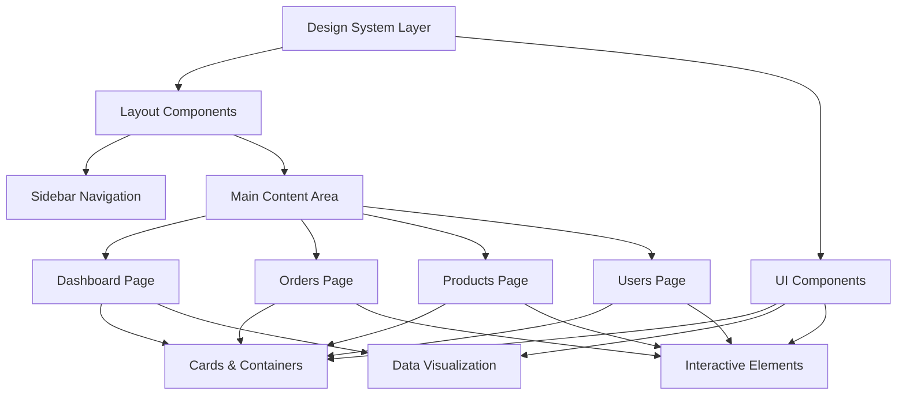
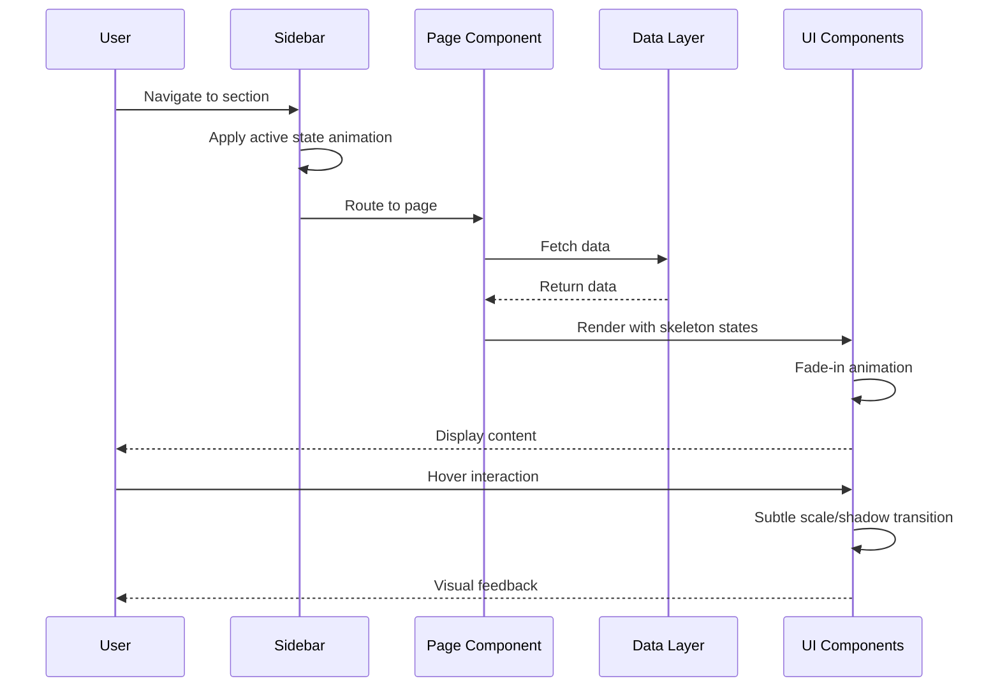
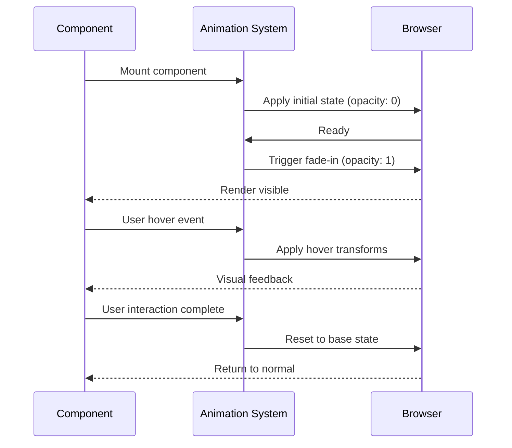

# Design Document: Modern Minimalist Dashboard Redesign

## Overview

This design document outlines a comprehensive visual redesign of the business management dashboard application, transforming it into a modern minimalist interface. The redesign focuses on clean aesthetics, improved visual hierarchy, enhanced whitespace utilization, and refined micro-interactions while maintaining all existing functionality. The approach leverages the existing tech stack (Next.js 14.2, React 18, TypeScript, Tailwind CSS 4.1, shadcn/ui) without introducing new dependencies, ensuring seamless integration and maintainability.

The redesign philosophy centers on three core principles: clarity through simplicity, intentional use of whitespace, and subtle yet purposeful animations. By reducing visual noise, emphasizing content hierarchy, and creating breathing room in the interface, users will experience a more focused and efficient workflow.

## Architecture

The redesign maintains the existing architectural structure while introducing visual and interaction enhancements at the component level. The system follows a layered approach where design tokens (colors, spacing, typography) cascade through the component hierarchy.



## Sequence Diagrams

### User Interaction Flow




### Animation & Transition Flow



## Components and Interfaces

### Component 1: MinimalistCard

**Purpose**: Provides a clean, elevated container for content with subtle shadows and refined borders

**Interface**:
```typescript
interface MinimalistCardProps {
  children: React.ReactNode
  variant?: 'default' | 'elevated' | 'flat' | 'bordered'
  padding?: 'none' | 'sm' | 'md' | 'lg'
  hover?: boolean
  className?: string
}

function MinimalistCard({
  children,
  variant = 'default',
  padding = 'md',
  hover = false,
  className
}: MinimalistCardProps): JSX.Element
```

**Responsibilities**:
- Render content within a minimalist container
- Apply appropriate spacing and elevation based on variant
- Handle hover states with smooth transitions
- Maintain consistent visual language across the application


### Component 2: MinimalistSidebar

**Purpose**: Provides clean, distraction-free navigation with refined visual hierarchy

**Interface**:
```typescript
interface MinimalistSidebarProps {
  navigation: NavigationItem[]
  currentPath: string
  onNavigate?: (path: string) => void
}

interface NavigationItem {
  name: string
  href: string
  icon: React.ReactNode
}

function MinimalistSidebar({
  navigation,
  currentPath,
  onNavigate
}: MinimalistSidebarProps): JSX.Element
```

**Responsibilities**:
- Render navigation items with active state indicators
- Handle mobile responsive behavior with slide-in drawer
- Apply smooth transitions for state changes
- Maintain minimal visual footprint while ensuring usability

### Component 3: MinimalistKPICard

**Purpose**: Displays key performance indicators with clean typography and subtle visual emphasis

**Interface**:
```typescript
interface MinimalistKPICardProps {
  title: string
  value: string | number
  trend?: {
    value: string
    direction: 'up' | 'down' | 'neutral'
  }
  icon?: React.ReactNode
  variant?: 'default' | 'primary' | 'success' | 'warning'
}

function MinimalistKPICard({
  title,
  value,
  trend,
  icon,
  variant = 'default'
}: MinimalistKPICardProps): JSX.Element
```

**Responsibilities**:
- Display KPI data with clear visual hierarchy
- Show trend indicators with appropriate color coding
- Apply subtle hover effects for interactivity
- Maintain consistent spacing and alignment

### Component 4: MinimalistChart

**Purpose**: Renders data visualizations with clean lines and minimal decoration

**Interface**:
```typescript
interface MinimalistChartProps {
  data: ChartDataPoint[]
  type: 'bar' | 'line' | 'donut'
  title: string
  description?: string
  height?: number
  showGrid?: boolean
  showLegend?: boolean
}

interface ChartDataPoint {
  label: string
  value: number
  color?: string
}

function MinimalistChart({
  data,
  type,
  title,
  description,
  height = 300,
  showGrid = false,
  showLegend = true
}: MinimalistChartProps): JSX.Element
```

**Responsibilities**:
- Render data visualizations with minimal visual noise
- Apply smooth animations on data updates
- Handle responsive sizing
- Provide accessible data representations


### Component 5: MinimalistTable

**Purpose**: Displays tabular data with clean rows, subtle borders, and refined typography

**Interface**:
```typescript
interface MinimalistTableProps<T> {
  data: T[]
  columns: ColumnDef<T>[]
  onRowClick?: (row: T) => void
  emptyMessage?: string
  loading?: boolean
}

interface ColumnDef<T> {
  key: keyof T
  header: string
  render?: (value: T[keyof T], row: T) => React.ReactNode
  align?: 'left' | 'center' | 'right'
  width?: string
}

function MinimalistTable<T>({
  data,
  columns,
  onRowClick,
  emptyMessage = 'No data available',
  loading = false
}: MinimalistTableProps<T>): JSX.Element
```

**Responsibilities**:
- Render tabular data with clean visual separation
- Handle loading states with skeleton UI
- Apply hover effects on interactive rows
- Support custom cell rendering

## Data Models

### Design Token System

```typescript
interface DesignTokens {
  colors: ColorTokens
  spacing: SpacingTokens
  typography: TypographyTokens
  shadows: ShadowTokens
  transitions: TransitionTokens
  borders: BorderTokens
}

interface ColorTokens {
  // Neutral palette - minimalist grayscale
  neutral: {
    50: string   // Lightest background
    100: string  // Light background
    200: string  // Subtle borders
    300: string  // Borders
    400: string  // Disabled text
    500: string  // Secondary text
    600: string  // Primary text
    700: string  // Headings
    800: string  // Strong emphasis
    900: string  // Darkest
  }
  
  // Accent colors - used sparingly
  primary: string      // Main brand color
  success: string      // Positive actions
  warning: string      // Caution states
  error: string        // Error states
  
  // Semantic colors
  background: string
  foreground: string
  border: string
  muted: string
}

interface SpacingTokens {
  xs: string    // 4px
  sm: string    // 8px
  md: string    // 16px
  lg: string    // 24px
  xl: string    // 32px
  '2xl': string // 48px
  '3xl': string // 64px
}

interface TypographyTokens {
  fontFamily: {
    sans: string
    mono: string
  }
  fontSize: {
    xs: string    // 12px
    sm: string    // 14px
    base: string  // 16px
    lg: string    // 18px
    xl: string    // 20px
    '2xl': string // 24px
    '3xl': string // 30px
    '4xl': string // 36px
  }
  fontWeight: {
    normal: number    // 400
    medium: number    // 500
    semibold: number  // 600
    bold: number      // 700
  }
  lineHeight: {
    tight: number   // 1.25
    normal: number  // 1.5
    relaxed: number // 1.75
  }
  letterSpacing: {
    tight: string   // -0.025em
    normal: string  // 0
    wide: string    // 0.025em
  }
}

interface ShadowTokens {
  none: string
  sm: string   // Subtle elevation
  md: string   // Card elevation
  lg: string   // Modal elevation
  xl: string   // Maximum elevation
}

interface TransitionTokens {
  fast: string     // 150ms
  normal: string   // 250ms
  slow: string     // 350ms
  easing: {
    default: string  // ease-in-out
    in: string       // ease-in
    out: string      // ease-out
  }
}

interface BorderTokens {
  width: {
    thin: string    // 1px
    medium: string  // 2px
    thick: string   // 4px
  }
  radius: {
    none: string
    sm: string   // 4px
    md: string   // 8px
    lg: string   // 12px
    full: string // 9999px
  }
}
```

**Validation Rules**:
- All color values must be in oklch format for consistent color perception
- Spacing values must follow 4px base grid system
- Typography scale must maintain 1.25 ratio between sizes
- Shadow values must use subtle opacity (max 0.1) for minimalist aesthetic
- Transitions must use consistent easing functions


### Component State Model

```typescript
interface ComponentState {
  variant: 'default' | 'hover' | 'active' | 'disabled' | 'loading'
  elevation: 0 | 1 | 2 | 3
  animation: AnimationState
}

interface AnimationState {
  isAnimating: boolean
  animationType: 'fade' | 'slide' | 'scale' | 'none'
  duration: number
  delay: number
}

// State transition rules
type StateTransition = {
  from: ComponentState['variant']
  to: ComponentState['variant']
  trigger: 'user-interaction' | 'data-load' | 'programmatic'
  animation: AnimationState['animationType']
}
```

**Validation Rules**:
- State transitions must be smooth and predictable
- Elevation changes must be accompanied by shadow transitions
- Loading states must show skeleton UI, not spinners
- Disabled states must reduce opacity to 0.5 and disable pointer events

## Algorithmic Pseudocode

### Main Rendering Algorithm

```typescript
/**
 * Algorithm: Render Minimalist Component
 * 
 * Preconditions:
 * - Component props are validated
 * - Design tokens are loaded
 * - Theme context is available
 * 
 * Postconditions:
 * - Component renders with correct styles
 * - Animations are applied smoothly
 * - Accessibility attributes are present
 * 
 * Loop Invariants:
 * - Style calculations remain consistent during render
 * - Animation states are properly tracked
 */

ALGORITHM renderMinimalistComponent(props, tokens, theme)
INPUT: props (component properties), tokens (design tokens), theme (light/dark)
OUTPUT: rendered React element

BEGIN
  ASSERT props IS valid
  ASSERT tokens IS loaded
  
  // Step 1: Calculate base styles from design tokens
  baseStyles ← calculateBaseStyles(props.variant, tokens)
  
  // Step 2: Apply theme-specific adjustments
  themedStyles ← applyThemeAdjustments(baseStyles, theme)
  
  // Step 3: Merge with custom className if provided
  finalStyles ← mergeStyles(themedStyles, props.className)
  
  // Step 4: Determine animation state
  animationState ← determineAnimationState(props.state)
  
  // Step 5: Apply accessibility attributes
  a11yAttributes ← generateA11yAttributes(props)
  
  // Step 6: Render with all computed properties
  element ← createElement(
    props.as || 'div',
    {
      className: finalStyles,
      style: animationState.inlineStyles,
      ...a11yAttributes,
      ...props.htmlAttributes
    },
    props.children
  )
  
  ASSERT element IS valid React element
  
  RETURN element
END
```

**Preconditions**:
- props object contains all required fields
- Design token system is initialized
- Theme provider is mounted in component tree

**Postconditions**:
- Returns valid React element
- All styles are properly applied
- Component is accessible (WCAG AA compliant)

**Loop Invariants**: N/A (no loops in main algorithm)


### Style Calculation Algorithm

```typescript
/**
 * Algorithm: Calculate Component Styles
 * 
 * Preconditions:
 * - variant is one of: 'default' | 'elevated' | 'flat' | 'bordered'
 * - tokens object contains all required design tokens
 * 
 * Postconditions:
 * - Returns valid Tailwind CSS class string
 * - Classes are properly merged without conflicts
 * 
 * Loop Invariants: N/A
 */

ALGORITHM calculateBaseStyles(variant, tokens)
INPUT: variant (string), tokens (DesignTokens)
OUTPUT: className (string)

BEGIN
  ASSERT variant IN ['default', 'elevated', 'flat', 'bordered']
  ASSERT tokens IS valid DesignTokens object
  
  // Initialize base classes that apply to all variants
  baseClasses ← [
    'rounded-lg',
    'transition-all',
    'duration-250',
    'ease-in-out'
  ]
  
  // Apply variant-specific classes
  IF variant = 'default' THEN
    variantClasses ← [
      'bg-white',
      'dark:bg-neutral-900',
      'border',
      'border-neutral-200',
      'dark:border-neutral-800',
      'shadow-sm'
    ]
  ELSE IF variant = 'elevated' THEN
    variantClasses ← [
      'bg-white',
      'dark:bg-neutral-900',
      'border-0',
      'shadow-md',
      'hover:shadow-lg'
    ]
  ELSE IF variant = 'flat' THEN
    variantClasses ← [
      'bg-neutral-50',
      'dark:bg-neutral-950',
      'border-0',
      'shadow-none'
    ]
  ELSE IF variant = 'bordered' THEN
    variantClasses ← [
      'bg-transparent',
      'border-2',
      'border-neutral-300',
      'dark:border-neutral-700',
      'shadow-none'
    ]
  END IF
  
  // Combine all classes
  allClasses ← baseClasses + variantClasses
  
  // Merge classes using tailwind-merge to resolve conflicts
  className ← mergeTailwindClasses(allClasses)
  
  ASSERT className IS non-empty string
  
  RETURN className
END
```

**Preconditions**:
- variant parameter is a valid variant type
- tokens parameter contains complete design token definitions

**Postconditions**:
- Returns non-empty string of Tailwind CSS classes
- No conflicting classes in the output
- Classes are optimized for minimal CSS output

**Loop Invariants**: N/A (no loops)


### Animation State Management Algorithm

```typescript
/**
 * Algorithm: Manage Component Animation State
 * 
 * Preconditions:
 * - Component is mounted in DOM
 * - Animation configuration is valid
 * 
 * Postconditions:
 * - Animation state is properly tracked
 * - Transitions are smooth and performant
 * - Cleanup is performed on unmount
 * 
 * Loop Invariants:
 * - Animation frame requests are properly cancelled
 * - State updates are batched for performance
 */

ALGORITHM manageAnimationState(component, config)
INPUT: component (React component), config (AnimationConfig)
OUTPUT: animationState (AnimationState)

BEGIN
  ASSERT component IS mounted
  ASSERT config.duration > 0
  
  // Initialize animation state
  state ← {
    isAnimating: false,
    progress: 0,
    startTime: null
  }
  
  // Step 1: Set up animation frame loop
  PROCEDURE animate(timestamp)
  BEGIN
    IF state.startTime = null THEN
      state.startTime ← timestamp
    END IF
    
    elapsed ← timestamp - state.startTime
    progress ← min(elapsed / config.duration, 1.0)
    
    // Apply easing function
    easedProgress ← applyEasing(progress, config.easing)
    
    // Update component with new progress
    state.progress ← easedProgress
    updateComponent(component, state)
    
    // Continue animation if not complete
    IF progress < 1.0 THEN
      requestAnimationFrame(animate)
    ELSE
      state.isAnimating ← false
      onAnimationComplete(component)
    END IF
  END PROCEDURE
  
  // Step 2: Start animation
  state.isAnimating ← true
  requestAnimationFrame(animate)
  
  // Step 3: Return cleanup function
  cleanup ← FUNCTION()
  BEGIN
    cancelAnimationFrame(animate)
    state.isAnimating ← false
  END FUNCTION
  
  ASSERT state.isAnimating = true OR state.progress = 1.0
  
  RETURN { state, cleanup }
END
```

**Preconditions**:
- Component is mounted and ready to animate
- Animation duration is positive number
- Easing function is defined

**Postconditions**:
- Animation runs smoothly at 60fps
- State is properly cleaned up
- No memory leaks from animation frames

**Loop Invariants**:
- progress value is always between 0 and 1
- Animation frames are requested only when isAnimating is true
- Component state remains consistent during animation


## Key Functions with Formal Specifications

### Function 1: applyMinimalistTheme()

```typescript
function applyMinimalistTheme(
  element: HTMLElement,
  theme: 'light' | 'dark',
  tokens: DesignTokens
): void
```

**Preconditions:**
- element is a valid DOM element
- theme is either 'light' or 'dark'
- tokens object contains all required design token definitions
- tokens.colors contains both light and dark mode values

**Postconditions:**
- CSS custom properties are set on element
- Theme-specific colors are applied
- Transitions are enabled for smooth theme switching
- No visual flash or layout shift occurs

**Loop Invariants:** N/A

### Function 2: calculateOptimalSpacing()

```typescript
function calculateOptimalSpacing(
  contentDensity: 'compact' | 'comfortable' | 'spacious',
  baseSpacing: number
): SpacingScale
```

**Preconditions:**
- contentDensity is one of: 'compact', 'comfortable', 'spacious'
- baseSpacing is positive number (typically 4 or 8)
- baseSpacing follows 4px grid system

**Postconditions:**
- Returns SpacingScale object with all spacing values
- All values are multiples of baseSpacing
- Scale maintains consistent ratios (1, 2, 4, 6, 8, 12, 16)
- Compact mode reduces spacing by 25%, spacious increases by 50%

**Loop Invariants:**
- For each spacing calculation: result is multiple of baseSpacing
- Spacing ratios remain proportional across density modes

### Function 3: optimizeChartRendering()

```typescript
function optimizeChartRendering(
  data: ChartDataPoint[],
  viewport: { width: number; height: number },
  options: ChartOptions
): OptimizedChartData
```

**Preconditions:**
- data array is non-empty
- viewport dimensions are positive numbers
- viewport.width >= 200 and viewport.height >= 100
- options.maxDataPoints is positive integer

**Postconditions:**
- Returns optimized data suitable for rendering
- Data points are reduced if exceeding maxDataPoints
- Visual fidelity is maintained through smart sampling
- Performance is optimized for 60fps rendering
- No data loss for critical points (min, max, inflection points)

**Loop Invariants:**
- During data sampling: critical points are always preserved
- Sampling maintains data distribution characteristics


### Function 4: generateSkeletonUI()

```typescript
function generateSkeletonUI(
  componentType: ComponentType,
  count: number,
  dimensions?: Dimensions
): React.ReactElement[]
```

**Preconditions:**
- componentType is valid component type ('card' | 'table' | 'chart' | 'text')
- count is positive integer
- count <= 50 (performance limit)
- dimensions (if provided) has positive width and height

**Postconditions:**
- Returns array of skeleton elements matching count
- Each skeleton matches the visual structure of componentType
- Skeletons have pulse animation applied
- Accessibility attributes indicate loading state
- Array length equals count parameter

**Loop Invariants:**
- For each iteration: skeleton element is valid React element
- All generated skeletons have consistent styling

### Function 5: handleResponsiveLayout()

```typescript
function handleResponsiveLayout(
  breakpoint: Breakpoint,
  layout: LayoutConfig
): ComputedLayout
```

**Preconditions:**
- breakpoint is one of: 'mobile' | 'tablet' | 'desktop' | 'wide'
- layout contains valid configuration for all breakpoints
- layout.columns is positive integer for each breakpoint
- layout.gap values are valid spacing tokens

**Postconditions:**
- Returns computed layout matching current breakpoint
- Grid columns are adjusted appropriately
- Spacing scales with viewport size
- Mobile layout is single column
- Desktop layout maximizes screen real estate
- No horizontal scrolling occurs

**Loop Invariants:** N/A

## Example Usage

### Example 1: Implementing Minimalist Card Component

```typescript
// components/ui/minimalist-card.tsx
import { cn } from '@/lib/utils'
import { cva, type VariantProps } from 'class-variance-authority'

const cardVariants = cva(
  // Base styles - applied to all variants
  'rounded-lg transition-all duration-250 ease-in-out',
  {
    variants: {
      variant: {
        default: 'bg-white dark:bg-neutral-900 border border-neutral-200 dark:border-neutral-800 shadow-sm',
        elevated: 'bg-white dark:bg-neutral-900 border-0 shadow-md hover:shadow-lg',
        flat: 'bg-neutral-50 dark:bg-neutral-950 border-0 shadow-none',
        bordered: 'bg-transparent border-2 border-neutral-300 dark:border-neutral-700 shadow-none'
      },
      padding: {
        none: 'p-0',
        sm: 'p-4',
        md: 'p-6',
        lg: 'p-8'
      },
      hover: {
        true: 'hover:scale-[1.01] cursor-pointer',
        false: ''
      }
    },
    defaultVariants: {
      variant: 'default',
      padding: 'md',
      hover: false
    }
  }
)

interface MinimalistCardProps
  extends React.HTMLAttributes<HTMLDivElement>,
    VariantProps<typeof cardVariants> {
  children: React.ReactNode
}

export function MinimalistCard({
  children,
  variant,
  padding,
  hover,
  className,
  ...props
}: MinimalistCardProps) {
  return (
    <div
      className={cn(cardVariants({ variant, padding, hover }), className)}
      {...props}
    >
      {children}
    </div>
  )
}
```


### Example 2: Redesigned KPI Cards with Minimalist Aesthetic

```typescript
// components/dashboard/minimalist-kpi-cards.tsx
'use client'

import { MinimalistCard } from '@/components/ui/minimalist-card'
import { TrendingUp, TrendingDown } from 'lucide-react'
import type { KPIData } from '@/lib/types'

interface MinimalistKPICardsProps {
  data: KPIData
}

export function MinimalistKPICards({ data }: MinimalistKPICardsProps) {
  const kpis = [
    {
      title: 'Orders Today',
      value: data.ordersToday,
      trend: { value: '+12%', direction: 'up' as const }
    },
    {
      title: 'Orders (7d)',
      value: data.orders7d,
      trend: { value: '+8%', direction: 'up' as const }
    },
    {
      title: 'Orders (30d)',
      value: data.orders30d,
      trend: { value: '+15%', direction: 'up' as const }
    },
    {
      title: 'Revenue Today',
      value: `€${data.revenueToday.toLocaleString('fr-FR', { minimumFractionDigits: 2 })}`,
      trend: { value: '+5%', direction: 'up' as const }
    },
    {
      title: 'Revenue (7d)',
      value: `€${data.revenue7d.toLocaleString('fr-FR', { minimumFractionDigits: 2 })}`,
      trend: { value: '+18%', direction: 'up' as const }
    },
    {
      title: 'Revenue (30d)',
      value: `€${data.revenue30d.toLocaleString('fr-FR', { minimumFractionDigits: 2 })}`,
      trend: { value: '-2%', direction: 'down' as const }
    }
  ]

  return (
    <div className="grid grid-cols-1 md:grid-cols-2 lg:grid-cols-3 gap-6">
      {kpis.map((kpi, index) => (
        <MinimalistCard
          key={index}
          variant="elevated"
          hover
          className="group"
        >
          {/* Title */}
          <div className="text-sm font-medium text-neutral-500 dark:text-neutral-400 mb-3">
            {kpi.title}
          </div>
          
          {/* Value */}
          <div className="text-3xl font-semibold text-neutral-900 dark:text-neutral-50 mb-2 tracking-tight">
            {kpi.value}
          </div>
          
          {/* Trend */}
          <div className="flex items-center gap-1.5">
            {kpi.trend.direction === 'up' ? (
              <TrendingUp className="w-4 h-4 text-emerald-600 dark:text-emerald-400" />
            ) : (
              <TrendingDown className="w-4 h-4 text-rose-600 dark:text-rose-400" />
            )}
            <span
              className={cn(
                'text-sm font-medium',
                kpi.trend.direction === 'up'
                  ? 'text-emerald-600 dark:text-emerald-400'
                  : 'text-rose-600 dark:text-rose-400'
              )}
            >
              {kpi.trend.value}
            </span>
            <span className="text-sm text-neutral-500 dark:text-neutral-400">
              from last period
            </span>
          </div>
        </MinimalistCard>
      ))}
    </div>
  )
}
```


### Example 3: Minimalist Sidebar Navigation

```typescript
// components/layout/minimalist-sidebar.tsx
'use client'

import Link from 'next/link'
import { usePathname } from 'next/navigation'
import { cn } from '@/lib/utils'
import { Button } from '@/components/ui/button'
import { Menu, X, LayoutDashboard, ShoppingCart, Package, Users } from 'lucide-react'
import { useState } from 'react'

const navigation = [
  { name: 'Dashboard', href: '/', icon: LayoutDashboard },
  { name: 'Orders', href: '/orders', icon: ShoppingCart },
  { name: 'Products', href: '/products', icon: Package },
  { name: 'Users', href: '/users', icon: Users }
]

export function MinimalistSidebar() {
  const pathname = usePathname()
  const [isMobileMenuOpen, setIsMobileMenuOpen] = useState(false)

  return (
    <>
      {/* Mobile menu button */}
      <div className="lg:hidden fixed top-6 left-6 z-50">
        <Button
          variant="ghost"
          size="icon"
          onClick={() => setIsMobileMenuOpen(!isMobileMenuOpen)}
          className="bg-white/80 dark:bg-neutral-900/80 backdrop-blur-sm border border-neutral-200 dark:border-neutral-800 hover:bg-white dark:hover:bg-neutral-900"
        >
          {isMobileMenuOpen ? (
            <X className="h-5 w-5" />
          ) : (
            <Menu className="h-5 w-5" />
          )}
        </Button>
      </div>

      {/* Sidebar */}
      <div
        className={cn(
          'fixed inset-y-0 left-0 z-40 w-64 bg-white dark:bg-neutral-950 border-r border-neutral-200 dark:border-neutral-800 transform transition-transform duration-300 ease-in-out lg:translate-x-0',
          isMobileMenuOpen ? 'translate-x-0' : '-translate-x-full'
        )}
      >
        <div className="flex flex-col h-full">
          {/* Logo */}
          <div className="flex items-center h-20 px-6 border-b border-neutral-200 dark:border-neutral-800">
            <h1 className="text-xl font-semibold text-neutral-900 dark:text-neutral-50 tracking-tight">
              Business Hub
            </h1>
          </div>

          {/* Navigation */}
          <nav className="flex-1 px-4 py-8 space-y-1">
            {navigation.map((item) => {
              const isActive = pathname === item.href
              const Icon = item.icon
              
              return (
                <Link
                  key={item.name}
                  href={item.href}
                  onClick={() => setIsMobileMenuOpen(false)}
                  className={cn(
                    'flex items-center gap-3 px-4 py-3 rounded-lg text-sm font-medium transition-all duration-200',
                    isActive
                      ? 'bg-neutral-900 dark:bg-neutral-50 text-white dark:text-neutral-900'
                      : 'text-neutral-600 dark:text-neutral-400 hover:bg-neutral-100 dark:hover:bg-neutral-900 hover:text-neutral-900 dark:hover:text-neutral-50'
                  )}
                >
                  <Icon className="h-5 w-5" />
                  {item.name}
                </Link>
              )
            })}
          </nav>

          {/* Footer */}
          <div className="p-6 border-t border-neutral-200 dark:border-neutral-800">
            <p className="text-xs text-neutral-500 dark:text-neutral-400 text-center">
              v1.0.0
            </p>
          </div>
        </div>
      </div>

      {/* Mobile overlay */}
      {isMobileMenuOpen && (
        <div
          className="fixed inset-0 z-30 bg-neutral-900/20 backdrop-blur-sm lg:hidden"
          onClick={() => setIsMobileMenuOpen(false)}
        />
      )}
    </>
  )
}
```


### Example 4: Minimalist Chart Component

```typescript
// components/dashboard/minimalist-revenue-chart.tsx
'use client'

import { MinimalistCard } from '@/components/ui/minimalist-card'
import type { RevenueChartData } from '@/lib/types'
import { useMemo } from 'react'

interface MinimalistRevenueChartProps {
  data: RevenueChartData[]
}

export function MinimalistRevenueChart({ data }: MinimalistRevenueChartProps) {
  const chartData = useMemo(() => {
    const maxRevenue = Math.max(...data.map((d) => d.revenue))
    return data.slice(-14).map((item) => ({
      ...item,
      heightPercent: (item.revenue / maxRevenue) * 100
    }))
  }, [data])

  const stats = useMemo(() => {
    const total = data.reduce((sum, item) => sum + item.revenue, 0)
    const avg = Math.round(total / data.length)
    return { total, avg }
  }, [data])

  return (
    <MinimalistCard variant="elevated">
      {/* Header */}
      <div className="mb-8">
        <h3 className="text-lg font-semibold text-neutral-900 dark:text-neutral-50 mb-1">
          Revenue Trend
        </h3>
        <p className="text-sm text-neutral-500 dark:text-neutral-400">
          Daily revenue over the last 14 days
        </p>
      </div>

      {/* Chart */}
      <div className="h-64 flex items-end justify-between gap-2 mb-6">
        {chartData.map((item, index) => (
          <div
            key={index}
            className="flex-1 flex flex-col items-center gap-3 group"
          >
            {/* Bar */}
            <div
              className="w-full bg-neutral-900 dark:bg-neutral-50 rounded-t transition-all duration-300 hover:opacity-80 min-h-[8px]"
              style={{ height: `${item.heightPercent}%` }}
              title={`€${item.revenue.toLocaleString('fr-FR')} on ${new Date(item.date).toLocaleDateString('fr-FR')}`}
            />
            
            {/* Date label */}
            <span className="text-[10px] text-neutral-400 dark:text-neutral-600 font-mono">
              {new Date(item.date).toLocaleDateString('fr-FR', {
                day: '2-digit',
                month: '2-digit'
              })}
            </span>
          </div>
        ))}
      </div>

      {/* Stats */}
      <div className="flex items-center justify-between pt-6 border-t border-neutral-200 dark:border-neutral-800">
        <div>
          <p className="text-xs text-neutral-500 dark:text-neutral-400 mb-1">
            Total
          </p>
          <p className="text-lg font-semibold text-neutral-900 dark:text-neutral-50">
            €{stats.total.toLocaleString('fr-FR')}
          </p>
        </div>
        <div className="text-right">
          <p className="text-xs text-neutral-500 dark:text-neutral-400 mb-1">
            Average
          </p>
          <p className="text-lg font-semibold text-neutral-900 dark:text-neutral-50">
            €{stats.avg.toLocaleString('fr-FR')}
          </p>
        </div>
      </div>
    </MinimalistCard>
  )
}
```


### Example 5: Global CSS Design Tokens

```typescript
// app/globals.css (minimalist redesign)
@import "tailwindcss";

@custom-variant dark (&:is(.dark *));

:root {
  /* Minimalist neutral palette - light mode */
  --background: oklch(0.99 0 0);           /* Pure white */
  --foreground: oklch(0.15 0 0);           /* Near black */
  
  --card: oklch(1 0 0);                    /* White cards */
  --card-foreground: oklch(0.15 0 0);
  
  --primary: oklch(0.15 0 0);              /* Black primary */
  --primary-foreground: oklch(0.99 0 0);   /* White text on black */
  
  --secondary: oklch(0.96 0 0);            /* Light gray */
  --secondary-foreground: oklch(0.15 0 0);
  
  --muted: oklch(0.96 0 0);                /* Subtle gray */
  --muted-foreground: oklch(0.45 0 0);     /* Medium gray text */
  
  --accent: oklch(0.94 0 0);               /* Lighter gray accent */
  --accent-foreground: oklch(0.15 0 0);
  
  --border: oklch(0.92 0 0);               /* Subtle borders */
  --input: oklch(0.96 0 0);
  --ring: oklch(0.15 0 0);
  
  /* Semantic colors - used sparingly */
  --success: oklch(0.55 0.15 145);         /* Emerald green */
  --warning: oklch(0.65 0.15 65);          /* Amber */
  --error: oklch(0.55 0.18 25);            /* Red */
  
  /* Chart colors - monochromatic with subtle variations */
  --chart-1: oklch(0.25 0 0);
  --chart-2: oklch(0.35 0 0);
  --chart-3: oklch(0.45 0 0);
  --chart-4: oklch(0.55 0 0);
  --chart-5: oklch(0.65 0 0);
  
  /* Spacing and layout */
  --radius: 0.5rem;                        /* 8px - subtle rounding */
  
  /* Sidebar */
  --sidebar: oklch(1 0 0);
  --sidebar-foreground: oklch(0.15 0 0);
  --sidebar-border: oklch(0.92 0 0);
}

.dark {
  /* Minimalist neutral palette - dark mode */
  --background: oklch(0.12 0 0);           /* Near black */
  --foreground: oklch(0.98 0 0);           /* Near white */
  
  --card: oklch(0.15 0 0);                 /* Dark cards */
  --card-foreground: oklch(0.98 0 0);
  
  --primary: oklch(0.98 0 0);              /* White primary */
  --primary-foreground: oklch(0.12 0 0);   /* Black text on white */
  
  --secondary: oklch(0.18 0 0);            /* Dark gray */
  --secondary-foreground: oklch(0.98 0 0);
  
  --muted: oklch(0.18 0 0);                /* Subtle dark gray */
  --muted-foreground: oklch(0.55 0 0);     /* Medium gray text */
  
  --accent: oklch(0.22 0 0);               /* Lighter dark gray accent */
  --accent-foreground: oklch(0.98 0 0);
  
  --border: oklch(0.22 0 0);               /* Subtle borders */
  --input: oklch(0.18 0 0);
  --ring: oklch(0.98 0 0);
  
  /* Semantic colors - adjusted for dark mode */
  --success: oklch(0.65 0.15 145);
  --warning: oklch(0.75 0.15 65);
  --error: oklch(0.65 0.18 25);
  
  /* Chart colors - lighter in dark mode */
  --chart-1: oklch(0.75 0 0);
  --chart-2: oklch(0.65 0 0);
  --chart-3: oklch(0.55 0 0);
  --chart-4: oklch(0.45 0 0);
  --chart-5: oklch(0.35 0 0);
  
  /* Sidebar */
  --sidebar: oklch(0.08 0 0);
  --sidebar-foreground: oklch(0.98 0 0);
  --sidebar-border: oklch(0.22 0 0);
}

@theme inline {
  --color-background: var(--background);
  --color-foreground: var(--foreground);
  --color-card: var(--card);
  --color-card-foreground: var(--card-foreground);
  --color-primary: var(--primary);
  --color-primary-foreground: var(--primary-foreground);
  --color-secondary: var(--secondary);
  --color-secondary-foreground: var(--secondary-foreground);
  --color-muted: var(--muted);
  --color-muted-foreground: var(--muted-foreground);
  --color-accent: var(--accent);
  --color-accent-foreground: var(--accent-foreground);
  --color-border: var(--border);
  --color-input: var(--input);
  --color-ring: var(--ring);
  --color-success: var(--success);
  --color-warning: var(--warning);
  --color-error: var(--error);
  --color-chart-1: var(--chart-1);
  --color-chart-2: var(--chart-2);
  --color-chart-3: var(--chart-3);
  --color-chart-4: var(--chart-4);
  --color-chart-5: var(--chart-5);
  --radius-sm: calc(var(--radius) - 2px);
  --radius-md: var(--radius);
  --radius-lg: calc(var(--radius) + 2px);
  --radius-xl: calc(var(--radius) + 4px);
  --color-sidebar: var(--sidebar);
  --color-sidebar-foreground: var(--sidebar-foreground);
  --color-sidebar-border: var(--sidebar-border);
}

@layer base {
  * {
    @apply border-border;
  }
  
  body {
    @apply bg-background text-foreground;
    font-feature-settings: "rlig" 1, "calt" 1;
  }
  
  /* Remove all background gradients for pure minimalism */
  html, body {
    background: var(--background);
  }
}

/* Minimalist animations - subtle and purposeful */
@layer utilities {
  .animate-fade-in {
    animation: fade-in 0.3s ease-out;
  }
  
  .animate-slide-up {
    animation: slide-up 0.4s ease-out;
  }
  
  @keyframes fade-in {
    from {
      opacity: 0;
    }
    to {
      opacity: 1;
    }
  }
  
  @keyframes slide-up {
    from {
      opacity: 0;
      transform: translateY(10px);
    }
    to {
      opacity: 1;
      transform: translateY(0);
    }
  }
}
```


## Correctness Properties

The following properties must hold true for the minimalist redesign to be considered correct and complete:

### Property 1: Visual Consistency

**Universal Quantification:**
```
∀ component ∈ Components:
  component.colorPalette ⊆ DesignTokens.colors ∧
  component.spacing ∈ SpacingScale ∧
  component.typography ∈ TypographyScale
```

**Meaning**: Every component must use only colors from the defined design token system, spacing values from the spacing scale, and typography from the typography scale. No arbitrary values are permitted.

**Validates: Requirements 12.1, 12.2, 12.3**

### Property 2: Accessibility Compliance

**Universal Quantification:**
```
∀ element ∈ InteractiveElements:
  contrastRatio(element.foreground, element.background) ≥ 4.5 ∧
  element.hasAccessibleName = true ∧
  element.hasFocusIndicator = true
```

**Meaning**: All interactive elements must meet WCAG AA contrast requirements (4.5:1 for normal text), have accessible names for screen readers, and display visible focus indicators for keyboard navigation.

**Validates: Requirements 11.1, 11.2, 11.3, 11.11**

### Property 3: Animation Performance

**Universal Quantification:**
```
∀ animation ∈ Animations:
  animation.fps ≥ 60 ∧
  animation.usesGPUAcceleration = true ∧
  animation.duration ≤ 400ms
```

**Meaning**: All animations must run at 60fps or higher, use GPU-accelerated properties (transform, opacity), and complete within 400ms to maintain perceived responsiveness.

**Validates: Requirements 10.1, 10.2, 10.3**

### Property 4: Responsive Behavior

**Universal Quantification:**
```
∀ viewport ∈ Viewports:
  ∀ component ∈ Components:
    component.isUsable(viewport) = true ∧
    component.hasNoHorizontalScroll(viewport) = true ∧
    component.maintainsHierarchy(viewport) = true
```

**Meaning**: Every component must be fully usable at all viewport sizes, never cause horizontal scrolling, and maintain visual hierarchy regardless of screen size.

**Validates: Requirements 9.4, 9.5, 9.10**

### Property 5: State Transition Smoothness

**Universal Quantification:**
```
∀ state_transition ∈ StateTransitions:
  state_transition.hasAnimation = true ∧
  state_transition.duration ∈ [150ms, 350ms] ∧
  state_transition.easing = 'ease-in-out'
```

**Meaning**: All state transitions must be animated, complete within 150-350ms, and use ease-in-out easing for natural motion.

**Validates: Requirements 2.8, 5.6, 8.2, 9.5**

### Property 6: Loading State Clarity

**Universal Quantification:**
```
∀ component ∈ DataDrivenComponents:
  component.hasLoadingState = true ∧
  component.loadingState.type = 'skeleton' ∧
  component.loadingState.matchesLayout = true
```

**Meaning**: All data-driven components must display skeleton loading states that match the final layout structure, not generic spinners.

**Validates: Requirements 7.1, 7.4, 7.5, 7.7, 13.5**

### Property 7: Whitespace Consistency

**Universal Quantification:**
```
∀ container ∈ Containers:
  container.padding ∈ SpacingScale ∧
  container.gap ∈ SpacingScale ∧
  container.margin ∈ SpacingScale
```

**Meaning**: All spacing (padding, gap, margin) must use values from the defined spacing scale to maintain consistent rhythm throughout the interface.

**Validates: Requirements 1.2, 24.1, 24.2, 24.3, 24.4, 24.5, 24.6, 24.7, 24.9, 24.10**

### Property 8: Typography Hierarchy

**Universal Quantification:**
```
∀ page ∈ Pages:
  ∃! heading ∈ page.elements: heading.level = 1 ∧
  ∀ heading ∈ page.headings:
    heading.fontSize > bodyText.fontSize ∧
    heading.fontWeight ≥ 600
```

**Meaning**: Each page must have exactly one h1 heading, and all headings must be larger than body text and use semibold or bolder weight.

**Validates: Requirements 20.1, 20.2, 20.3, 20.4, 20.5, 20.6, 20.7, 20.10**

### Property 9: Component Hover Effects

**Universal Quantification:**
```
∀ component ∈ InteractiveComponents:
  component.hasHoverState = true ∧
  component.hoverTransition.duration ≤ 300ms ∧
  component.hoverTransition.isSmooth = true
```

**Meaning**: All interactive components must have hover states with smooth transitions completing within 300ms.

**Validates: Requirements 2.7, 4.9, 5.6, 6.3, 23.9, 25.7**

### Property 10: Disabled State Consistency

**Universal Quantification:**
```
∀ component ∈ InteractiveComponents:
  component.isDisabled = true ⟹
    component.opacity = 0.5 ∧
    component.pointerEvents = 'none' ∧
    component.cursor = 'not-allowed'
```

**Meaning**: All disabled components must have 0.5 opacity, disabled pointer events, and not-allowed cursor.

**Validates: Requirements 13.4, 14.8, 25.8**

### Property 11: Theme Color Consistency

**Universal Quantification:**
```
∀ theme ∈ Themes:
  ∀ colorPair ∈ theme.colorPairs:
    contrastRatio(colorPair.foreground, colorPair.background) ≥ 4.5
```

**Meaning**: All color combinations in both light and dark themes must maintain WCAG AA contrast ratios.

**Validates: Requirements 1.1, 8.3, 8.7, 22.6, 22.7, 22.8, 22.9, 22.10**

### Property 12: Touch Target Accessibility

**Universal Quantification:**
```
∀ element ∈ InteractiveElements:
  viewport.width < 768px ⟹
    element.width ≥ 44px ∧
    element.height ≥ 44px
```

**Meaning**: All interactive elements must have minimum 44x44px touch targets on mobile devices.

**Validates: Requirements 18.1, 18.2**

### Property 13: Icon Consistency

**Universal Quantification:**
```
∀ icon ∈ Icons:
  icon.library = 'lucide-react' ∧
  icon.strokeWidth = 2 ∧
  icon.color = inheritFromParent
```

**Meaning**: All icons must come from Lucide React library, use 2px stroke width, and inherit color from parent text.

**Validates: Requirements 21.1, 21.5, 21.6**

### Property 14: Shadow Elevation System

**Universal Quantification:**
```
∀ component ∈ Components:
  component.shadow ∈ {none, sm, md, lg, xl} ∧
  component.shadow.opacity ≤ 0.1 ∧
  component.isHovered ⟹ component.shadow = nextLevel(component.shadow)
```

**Meaning**: All components use predefined shadow levels with maximum 0.1 opacity, and hoverable components increase shadow by one level on hover.

**Validates: Requirements 23.1, 23.2, 23.3, 23.4, 23.5, 23.9, 23.10**

### Property 15: Modal Focus Management

**Universal Quantification:**
```
∀ modal ∈ Modals:
  modal.isOpen = true ⟹
    modal.trapsFocus = true ∧
    modal.restoresFocusOnClose = true ∧
    modal.closesOnEscape = true
```

**Meaning**: All open modals must trap keyboard focus, restore focus when closed, and close on Escape key.

**Validates: Requirements 26.6, 26.7, 26.8**

### Property 16: Chart Data Visualization

**Universal Quantification:**
```
∀ chart ∈ Charts:
  ∀ bar ∈ chart.bars:
    bar.height = (bar.value / chart.maxValue) × 100% ∧
    bar.height ≥ 8px
```

**Meaning**: All chart bars must be sized as percentages of maximum value with minimum 8px height for visibility.

**Validates: Requirements 5.8, 5.11**

### Property 17: Pagination State Management

**Universal Quantification:**
```
∀ pagination ∈ Paginations:
  (pagination.currentPage = 1 ⟹ pagination.previousButton.disabled = true) ∧
  (pagination.currentPage = pagination.totalPages ⟹ pagination.nextButton.disabled = true)
```

**Meaning**: Pagination must disable previous button on first page and next button on last page.

**Validates: Requirements 30.3, 30.4**

### Property 18: Input Debouncing

**Universal Quantification:**
```
∀ searchInput ∈ SearchInputs:
  searchInput.debounceDelay = 300ms ∧
  searchInput.triggersSearchAfterDelay = true
```

**Meaning**: All search inputs must debounce user input by 300ms before triggering search.

**Validates: Requirements 29.3**

### Property 19: Toast Auto-Dismiss

**Universal Quantification:**
```
∀ toast ∈ Toasts:
  toast.autoDismissDelay = 5000ms ∧
  (toast.isHovered ⟹ toast.autoDismiss.paused = true)
```

**Meaning**: All toasts must auto-dismiss after 5 seconds unless user hovers over them.

**Validates: Requirements 27.6, 27.7**

### Property 20: Layout Stability

**Universal Quantification:**
```
∀ component ∈ Components:
  component.cumulativeLayoutShift < 0.1 ∧
  (component.state = 'loading' → component.state = 'loaded' ⟹
    component.layoutShift = 0)
```

**Meaning**: All components must maintain layout stability with CLS below 0.1, and loading-to-loaded transitions must not cause layout shift.

**Validates: Requirements 7.7, 16.4**


## Error Handling

### Error Scenario 1: Theme Transition Failure

**Condition**: User switches between light and dark mode, but CSS custom properties fail to update

**Response**: 
- Detect theme change event
- Verify CSS custom properties are applied
- If verification fails, force re-render of root component
- Log error to console for debugging

**Recovery**:
- Fallback to system preference theme
- Display toast notification: "Theme switch failed, using system preference"
- Retry theme application after 1 second

### Error Scenario 2: Animation Performance Degradation

**Condition**: Animation frame rate drops below 30fps for more than 500ms

**Response**:
- Detect low frame rate using Performance API
- Disable non-critical animations
- Reduce animation complexity (remove scale transforms, keep only opacity)
- Log performance metrics

**Recovery**:
- Store preference in localStorage to disable animations on future visits
- Provide user setting to re-enable animations
- Show subtle message: "Animations reduced for better performance"

### Error Scenario 3: Responsive Layout Breakage

**Condition**: Component overflows viewport or causes horizontal scroll

**Response**:
- Detect overflow using ResizeObserver
- Apply emergency responsive styles (max-width: 100%, overflow: hidden)
- Log component identifier and viewport dimensions
- Capture screenshot if possible

**Recovery**:
- Force component to fit within viewport
- Reduce padding/margins if necessary
- Display warning in development mode
- Report issue to error tracking service

### Error Scenario 4: Design Token Loading Failure

**Condition**: CSS custom properties are not defined or have invalid values

**Response**:
- Check for presence of required CSS variables on mount
- Validate color values are in oklch format
- Validate spacing values are valid CSS units

**Recovery**:
- Inject fallback design tokens inline
- Use hardcoded values as last resort
- Display warning banner: "Design system failed to load, using fallback styles"
- Retry loading after 2 seconds

### Error Scenario 5: Component Render Failure

**Condition**: Component throws error during render due to invalid props or state

**Response**:
- Catch error using Error Boundary
- Log error details (component name, props, stack trace)
- Display minimalist error UI in place of component

**Recovery**:
- Show fallback UI: "Unable to display this section"
- Provide retry button
- Preserve surrounding layout
- Report error to monitoring service


## Testing Strategy

### Unit Testing Approach

**Objective**: Verify individual components render correctly with minimalist styling and handle props appropriately

**Key Test Cases**:

1. **Component Rendering**
   - Test each variant renders with correct classes
   - Verify default props are applied
   - Ensure custom className merges properly
   - Check children are rendered correctly

2. **Style Calculation**
   - Test `calculateBaseStyles()` returns correct classes for each variant
   - Verify Tailwind class merging resolves conflicts
   - Ensure responsive classes are applied at correct breakpoints
   - Test dark mode classes are included

3. **Animation State**
   - Test animation state initializes correctly
   - Verify state transitions trigger animations
   - Ensure cleanup functions are called on unmount
   - Test animation frame cancellation

4. **Accessibility**
   - Verify ARIA attributes are present
   - Test keyboard navigation works
   - Ensure focus indicators are visible
   - Check screen reader announcements

**Testing Tools**:
- Jest for test runner
- React Testing Library for component testing
- @testing-library/user-event for interaction testing
- jest-axe for accessibility testing

**Example Test**:
```typescript
describe('MinimalistCard', () => {
  it('renders with default variant', () => {
    const { container } = render(
      <MinimalistCard>Content</MinimalistCard>
    )
    
    const card = container.firstChild
    expect(card).toHaveClass('rounded-lg')
    expect(card).toHaveClass('bg-white')
    expect(card).toHaveClass('dark:bg-neutral-900')
  })
  
  it('applies elevated variant styles', () => {
    const { container } = render(
      <MinimalistCard variant="elevated">Content</MinimalistCard>
    )
    
    const card = container.firstChild
    expect(card).toHaveClass('shadow-md')
    expect(card).toHaveClass('hover:shadow-lg')
  })
  
  it('merges custom className', () => {
    const { container } = render(
      <MinimalistCard className="custom-class">Content</MinimalistCard>
    )
    
    const card = container.firstChild
    expect(card).toHaveClass('custom-class')
    expect(card).toHaveClass('rounded-lg') // base class still present
  })
})
```

### Property-Based Testing Approach

**Objective**: Verify design system properties hold across all possible inputs and states

**Property Test Library**: fast-check (TypeScript/JavaScript property-based testing)

**Key Properties to Test**:

1. **Color Contrast Property**
   ```typescript
   // Property: All color combinations meet WCAG AA contrast requirements
   fc.assert(
     fc.property(
       fc.constantFrom('foreground', 'primary', 'success', 'warning', 'error'),
       fc.constantFrom('background', 'card', 'muted'),
       (fgColor, bgColor) => {
         const contrast = calculateContrast(
           getColorValue(fgColor),
           getColorValue(bgColor)
         )
         return contrast >= 4.5
       }
     )
   )
   ```

2. **Spacing Scale Property**
   ```typescript
   // Property: All spacing values are multiples of base unit (4px)
   fc.assert(
     fc.property(
       fc.constantFrom('xs', 'sm', 'md', 'lg', 'xl', '2xl', '3xl'),
       (spacingKey) => {
         const value = getSpacingValue(spacingKey)
         const pixels = parseFloat(value)
         return pixels % 4 === 0
       }
     )
   )
   ```

3. **Animation Duration Property**
   ```typescript
   // Property: All animations complete within acceptable time range
   fc.assert(
     fc.property(
       fc.constantFrom('fade', 'slide', 'scale'),
       (animationType) => {
         const duration = getAnimationDuration(animationType)
         return duration >= 150 && duration <= 400
       }
     )
   )
   ```

4. **Responsive Layout Property**
   ```typescript
   // Property: Components never cause horizontal scroll at any viewport
   fc.assert(
     fc.property(
       fc.integer({ min: 320, max: 2560 }), // viewport width
       fc.constantFrom('card', 'table', 'chart', 'form'),
       (viewportWidth, componentType) => {
         const component = renderComponent(componentType, viewportWidth)
         return component.scrollWidth <= viewportWidth
       }
     )
   )
   ```

5. **State Transition Property**
   ```typescript
   // Property: All state transitions are reversible
   fc.assert(
     fc.property(
       fc.constantFrom('default', 'hover', 'active', 'disabled'),
       fc.constantFrom('default', 'hover', 'active', 'disabled'),
       (fromState, toState) => {
         const component = createComponent(fromState)
         component.transitionTo(toState)
         component.transitionTo(fromState)
         return component.state === fromState
       }
     )
   )
   ```

**Testing Approach**:
- Run property tests with 1000+ random inputs
- Use shrinking to find minimal failing cases
- Test edge cases (min/max viewport sizes, extreme values)
- Verify properties hold in both light and dark modes


### Integration Testing Approach

**Objective**: Verify complete user flows work correctly with minimalist redesign

**Key Integration Tests**:

1. **Dashboard Loading Flow**
   - Navigate to dashboard
   - Verify skeleton states appear immediately
   - Wait for data to load
   - Verify smooth transition from skeleton to content
   - Check all KPI cards render with correct styling
   - Verify charts display with minimalist aesthetic

2. **Theme Switching Flow**
   - Start in light mode
   - Click theme toggle
   - Verify smooth transition to dark mode
   - Check all components update colors
   - Verify no flash of unstyled content
   - Switch back to light mode
   - Verify preference is persisted

3. **Responsive Navigation Flow**
   - Resize viewport to mobile size
   - Verify sidebar collapses
   - Click mobile menu button
   - Verify sidebar slides in smoothly
   - Click navigation item
   - Verify sidebar closes and page navigates
   - Check layout adapts to mobile viewport

4. **Data Interaction Flow**
   - Hover over KPI card
   - Verify subtle scale and shadow transition
   - Click on chart bar
   - Verify tooltip appears with data
   - Hover over table row
   - Verify background color changes smoothly
   - Click row to navigate
   - Verify transition is smooth

**Testing Tools**:
- Playwright for end-to-end testing
- Visual regression testing with Percy or Chromatic
- Lighthouse for performance and accessibility audits

**Example Integration Test**:
```typescript
test('dashboard loads with minimalist design', async ({ page }) => {
  // Navigate to dashboard
  await page.goto('/')
  
  // Verify skeleton states appear
  await expect(page.locator('[data-testid="kpi-skeleton"]')).toBeVisible()
  
  // Wait for data to load
  await page.waitForSelector('[data-testid="kpi-card"]')
  
  // Verify minimalist styling
  const card = page.locator('[data-testid="kpi-card"]').first()
  await expect(card).toHaveCSS('border-radius', '8px')
  await expect(card).toHaveCSS('box-shadow', /^0px/)
  
  // Verify hover effect
  await card.hover()
  await expect(card).toHaveCSS('transform', /scale/)
  
  // Take screenshot for visual regression
  await expect(page).toHaveScreenshot('dashboard-minimalist.png')
})
```

## Performance Considerations

### Rendering Performance

**Optimization Strategy**:
- Use React.memo for components that receive stable props
- Implement useMemo for expensive calculations (chart data processing)
- Use useCallback for event handlers passed to child components
- Lazy load chart components with React.lazy and Suspense
- Virtualize long lists (orders, products) with react-window

**Target Metrics**:
- First Contentful Paint (FCP): < 1.5s
- Largest Contentful Paint (LCP): < 2.5s
- Time to Interactive (TTI): < 3.5s
- Cumulative Layout Shift (CLS): < 0.1

### Animation Performance

**Optimization Strategy**:
- Use only GPU-accelerated properties (transform, opacity)
- Avoid animating layout properties (width, height, margin, padding)
- Use will-change sparingly and only during animation
- Implement requestAnimationFrame for custom animations
- Debounce resize and scroll event handlers

**Target Metrics**:
- Animation frame rate: 60fps (16.67ms per frame)
- Animation jank: < 5% of frames
- Total animation duration: < 400ms

### Bundle Size

**Optimization Strategy**:
- Tree-shake unused Tailwind classes with PurgeCSS
- Import only used Lucide icons
- Code-split routes with Next.js automatic code splitting
- Compress images and use WebP format
- Minimize use of third-party libraries

**Target Metrics**:
- Initial bundle size: < 200KB (gzipped)
- Total JavaScript: < 500KB (gzipped)
- CSS bundle: < 50KB (gzipped)

### Data Fetching Performance

**Optimization Strategy**:
- Use TanStack Query caching to avoid redundant requests
- Implement stale-while-revalidate strategy
- Prefetch data on hover for predictive loading
- Use React Server Components where possible
- Implement pagination for large datasets

**Target Metrics**:
- API response time: < 200ms (p95)
- Cache hit rate: > 80%
- Time to first data: < 500ms


## Security Considerations

### Client-Side Security

**XSS Prevention**:
- All user-generated content is sanitized before rendering
- React's built-in XSS protection through JSX escaping
- No use of dangerouslySetInnerHTML without sanitization
- Content Security Policy (CSP) headers configured

**Data Exposure**:
- No sensitive data stored in localStorage without encryption
- Session tokens stored in httpOnly cookies
- No API keys or secrets in client-side code
- Proper CORS configuration on API routes

### Theme Injection Prevention

**Risk**: Malicious CSS injection through theme customization

**Mitigation**:
- Theme values are predefined and not user-configurable
- CSS custom properties are set only from trusted sources
- No dynamic CSS generation from user input
- Strict Content Security Policy for styles

### Accessibility Security

**Risk**: Malicious content in ARIA labels or descriptions

**Mitigation**:
- Sanitize all dynamic ARIA attribute values
- Use predefined ARIA labels where possible
- Validate user input before using in accessibility attributes
- Regular accessibility audits

## Dependencies

### Core Dependencies (Already in Project)

**UI Framework**:
- next@14.2 - React framework with App Router
- react@18 - UI library
- react-dom@18 - React DOM renderer

**Styling**:
- tailwindcss@4.1 - Utility-first CSS framework
- tailwind-merge - Merge Tailwind classes without conflicts
- class-variance-authority - Component variant management
- tailwindcss-animate - Animation utilities

**UI Components**:
- @radix-ui/* - Headless UI primitives (already installed for shadcn/ui)
- lucide-react - Icon library
- sonner - Toast notifications
- vaul - Drawer component

**State Management**:
- @tanstack/react-query@5 - Server state management

**Forms**:
- react-hook-form - Form handling
- zod - Schema validation

**Utilities**:
- date-fns - Date manipulation
- clsx - Conditional class names

### No New Dependencies Required

The minimalist redesign uses only existing dependencies. All new components will be built using:
- Existing shadcn/ui components as base
- Tailwind CSS for styling
- Radix UI primitives for accessibility
- Lucide React for icons

### Development Dependencies

**Testing** (to be added if not present):
- @testing-library/react - Component testing
- @testing-library/jest-dom - Jest matchers
- @testing-library/user-event - User interaction simulation
- jest-axe - Accessibility testing
- fast-check - Property-based testing
- @playwright/test - End-to-end testing

**Type Safety**:
- typescript@5 - Already installed
- @types/react - Already installed
- @types/node - Already installed

## Implementation Phases

### Phase 1: Design System Foundation (Week 1)

**Tasks**:
1. Update globals.css with minimalist color palette
2. Define design tokens in CSS custom properties
3. Create utility classes for common patterns
4. Document design system in Storybook or similar

**Deliverables**:
- Updated globals.css
- Design token documentation
- Color palette reference
- Spacing scale reference

### Phase 2: Core Components (Week 2)

**Tasks**:
1. Create MinimalistCard component with variants
2. Update Button component with minimalist styling
3. Create MinimalistTable component
4. Update Input and Form components
5. Create skeleton loading components

**Deliverables**:
- 5+ reusable minimalist components
- Component documentation
- Unit tests for each component
- Storybook stories

### Phase 3: Layout Components (Week 3)

**Tasks**:
1. Redesign Sidebar with minimalist aesthetic
2. Update main layout structure
3. Implement responsive behavior
4. Add smooth transitions between states
5. Optimize mobile experience

**Deliverables**:
- Updated Sidebar component
- Updated layout.tsx
- Mobile-responsive navigation
- Integration tests for navigation

### Phase 4: Dashboard Redesign (Week 4)

**Tasks**:
1. Redesign KPI cards with minimalist styling
2. Update revenue chart with clean visualization
3. Redesign order status chart
4. Update recent orders table
5. Implement loading states

**Deliverables**:
- Updated dashboard page
- Minimalist chart components
- Skeleton loading states
- Visual regression tests

### Phase 5: Feature Pages (Week 5-6)

**Tasks**:
1. Redesign Orders pages (list, detail, create)
2. Redesign Products pages
3. Redesign Users pages
4. Update all forms with minimalist styling
5. Implement consistent error states

**Deliverables**:
- Updated Orders pages
- Updated Products pages
- Updated Users pages
- Consistent form styling
- Error handling UI

### Phase 6: Polish & Testing (Week 7)

**Tasks**:
1. Conduct accessibility audit
2. Run performance tests
3. Fix visual inconsistencies
4. Add micro-interactions
5. Complete documentation

**Deliverables**:
- Accessibility report (WCAG AA compliant)
- Performance report (Lighthouse score > 90)
- Complete design system documentation
- Migration guide for future components

## Success Metrics

### Visual Quality Metrics

- Design consistency score: 100% (all components use design tokens)
- Color contrast compliance: 100% (WCAG AA)
- Typography hierarchy consistency: 100%
- Spacing consistency: 100% (all spacing from scale)

### Performance Metrics

- Lighthouse Performance score: > 90
- First Contentful Paint: < 1.5s
- Largest Contentful Paint: < 2.5s
- Cumulative Layout Shift: < 0.1
- Time to Interactive: < 3.5s

### User Experience Metrics

- Animation smoothness: 60fps
- Theme switch time: < 300ms
- Page transition time: < 200ms
- Mobile usability score: 100%

### Code Quality Metrics

- Component test coverage: > 80%
- Property test coverage: 100% (all design properties tested)
- Integration test coverage: > 70%
- TypeScript strict mode: enabled
- Zero accessibility violations (jest-axe)

## Conclusion

This design document outlines a comprehensive approach to redesigning the business dashboard with a modern minimalist aesthetic. The redesign maintains all existing functionality while dramatically improving visual clarity, consistency, and user experience through:

- A refined monochromatic color palette with subtle accents
- Generous whitespace and intentional spacing
- Smooth, purposeful animations
- Clean typography hierarchy
- Accessible, keyboard-friendly interactions
- Responsive design across all devices

The implementation leverages only existing dependencies (Tailwind CSS, shadcn/ui, Radix UI, Lucide React) and follows established patterns in the codebase. All components are designed with accessibility, performance, and maintainability as core principles.

The phased implementation approach ensures steady progress with testable deliverables at each stage, culminating in a polished, production-ready minimalist dashboard that enhances user productivity and satisfaction.
