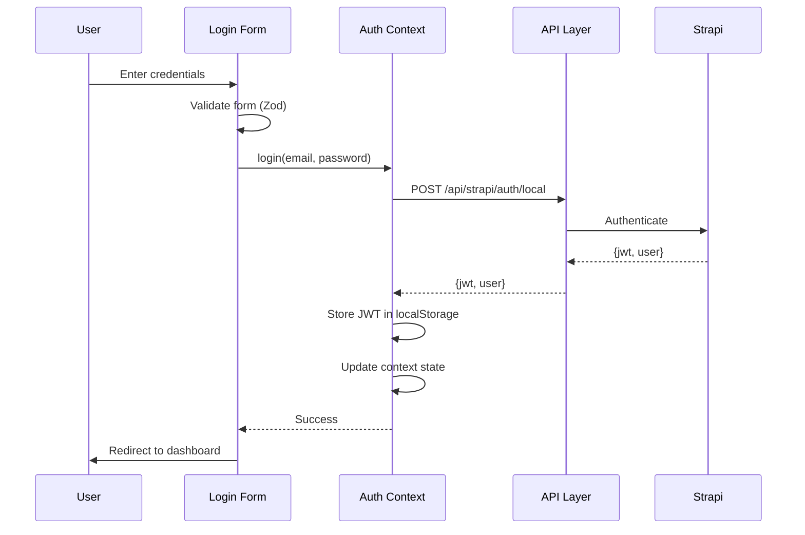
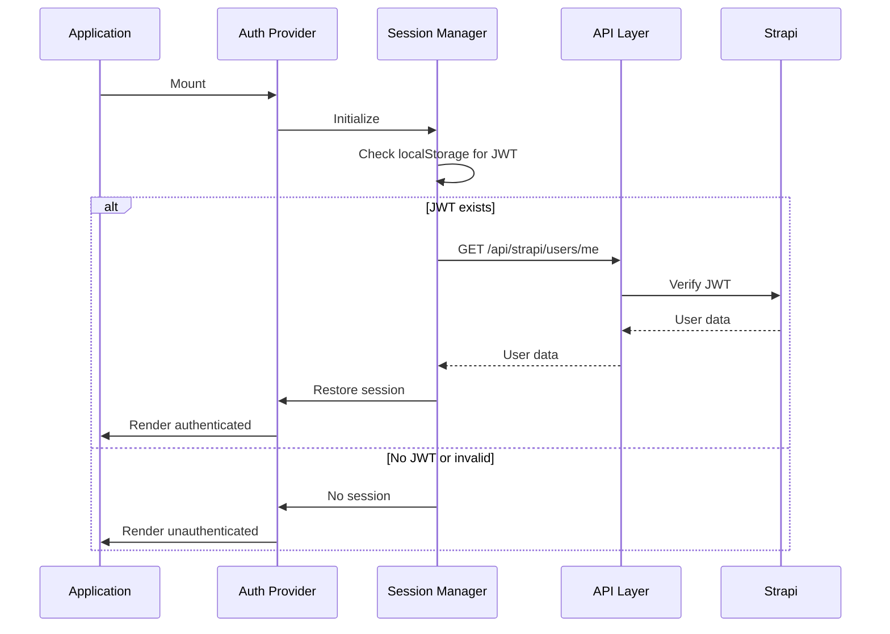
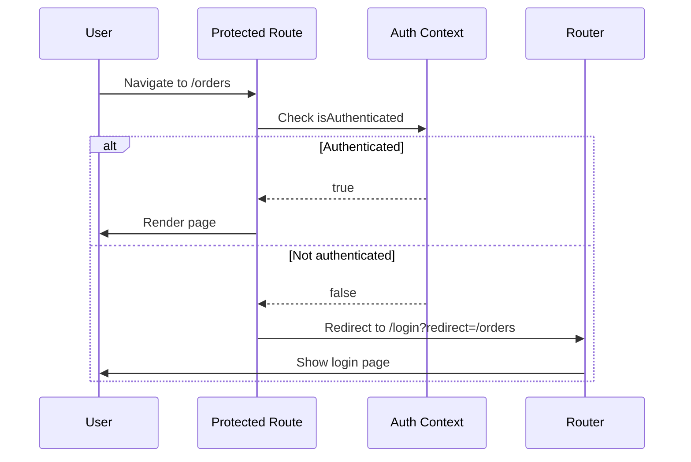

# Design Document: Strapi Authentication Integration

## Overview

This design implements a complete authentication system for the Next.js dashboard application, integrating with Strapi's built-in authentication API. The solution provides secure user login, session management, route protection, and role-based access control using React Context, Next.js App Router patterns, and Strapi's JWT-based authentication.

### Key Design Decisions

1. **React Context for State Management**: Use React Context API for authentication state rather than a global state library, maintaining consistency with the existing codebase that uses TanStack Query for server state and React hooks for local state.

2. **localStorage for Token Storage**: Store JWT tokens in localStorage rather than httpOnly cookies. While httpOnly cookies are more secure, they require server-side session management which adds complexity. localStorage provides a simpler implementation suitable for this dashboard application with the understanding that XSS protection must be maintained through other means (CSP headers, input sanitization).

3. **Client-Side Route Protection**: Implement route protection using client-side checks with React components rather than middleware. This approach works well with the App Router's RSC architecture and provides flexibility for loading states and redirects.

4. **Extend Existing API Layer**: Enhance the existing `lib/api.ts` module with authentication capabilities rather than creating a separate auth API layer, maintaining consistency with the current architecture.

5. **Strapi's /api/auth/local Endpoint**: Use Strapi's standard local authentication strategy which returns a JWT token and user object. This is the recommended approach for Strapi v4/v5.

### Architecture Diagram

```mermaid
graph TB
    subgraph "Next.js Frontend"
        A[App Layout] --> B[Auth Provider]
        B --> C[Protected Routes]
        C --> D[Dashboard Pages]
        B --> E[Login Page]
        B --> F[Auth Context]
        F --> G[Session Manager]
        G --> H[API Layer]
    end
    
    subgraph "Strapi Backend"
        I[/api/auth/local] --> J[JWT Generation]
        K[/api/users/me] --> L[User Validation]
        M[Protected Endpoints] --> N[JWT Verification]
    end
    
    H --> I
    H --> K
    H --> M
    
    style B fill:#e1f5ff
    style F fill:#e1f5ff
    style G fill:#e1f5ff
```

## Architecture

### Component Hierarchy

```
RootLayout (app/layout.tsx)
└── Providers (app/providers.tsx)
    ├── ThemeProvider
    ├── ReactQueryProvider
    └── AuthProvider (NEW)
        ├── AuthContext
        └── SessionManager
            └── App Content
                ├── Login Page (public)
                └── Protected Routes
                    ├── ProtectedRoute wrapper
                    └── RoleGuard wrapper
                        └── Dashboard Pages
```

### Authentication Flow

#### Login Flow



#### Session Restoration Flow



#### Protected Route Flow



### Data Flow

1. **Authentication State**: Managed in AuthContext, flows down to all components via React Context
2. **API Requests**: All requests flow through `lib/api.ts`, which adds JWT token to headers
3. **Session Persistence**: JWT stored in localStorage, read on app initialization
4. **Error Handling**: 401 responses trigger session invalidation and redirect to login

## Components and Interfaces

### 1. AuthProvider Component

**Location**: `components/providers/auth-provider.tsx`

**Purpose**: Wraps the application to provide authentication context and manage session state.

**Props**:
```typescript
interface AuthProviderProps {
  children: React.ReactNode;
}
```

**State**:
```typescript
interface AuthState {
  user: User | null;
  isLoading: boolean;
  isAuthenticated: boolean;
}
```

**Methods**:
- `login(email: string, password: string): Promise<void>` - Authenticate user
- `logout(): void` - Clear session and redirect to login
- `refreshSession(): Promise<void>` - Verify and refresh current session

### 2. AuthContext

**Location**: `lib/contexts/auth-context.ts`

**Purpose**: Provides authentication state and methods to consuming components.

**Interface**:
```typescript
interface AuthContextValue {
  user: User | null;
  isLoading: boolean;
  isAuthenticated: boolean;
  login: (email: string, password: string) => Promise<void>;
  logout: () => void;
  refreshSession: () => Promise<void>;
}
```

**Usage**:
```typescript
const { user, isAuthenticated, login, logout } = useAuth();
```

### 3. ProtectedRoute Component

**Location**: `components/auth/protected-route.tsx`

**Purpose**: Wraps pages that require authentication, redirects unauthenticated users to login.

**Props**:
```typescript
interface ProtectedRouteProps {
  children: React.ReactNode;
  fallback?: React.ReactNode; // Optional loading fallback
}
```

**Behavior**:
- Checks `isAuthenticated` from AuthContext
- If loading, shows fallback or loading spinner
- If not authenticated, redirects to `/login` with return URL
- If authenticated, renders children

### 4. RoleGuard Component

**Location**: `components/auth/role-guard.tsx`

**Purpose**: Restricts component rendering based on user roles.

**Props**:
```typescript
interface RoleGuardProps {
  children: React.ReactNode;
  allowedRoles: string[]; // e.g., ['admin', 'manager']
  requireAll?: boolean; // If true, user must have all roles; if false, any role
  fallback?: React.ReactNode; // What to show if access denied
}
```

**Behavior**:
- Checks user roles against `allowedRoles`
- If user has required role(s), renders children
- Otherwise, renders fallback or access denied message

### 5. LoginForm Component

**Location**: `components/auth/login-form.tsx`

**Purpose**: Handles user credential input and submission.

**Form Schema** (Zod):
```typescript
const loginSchema = z.object({
  email: z.string().email('Invalid email address'),
  password: z.string().min(1, 'Password is required'),
});

type LoginFormData = z.infer<typeof loginSchema>;
```

**State**:
- Form state managed by React Hook Form
- Loading state during submission
- Error message state for authentication failures

**Methods**:
- `onSubmit(data: LoginFormData): Promise<void>` - Handles form submission

### 6. Login Page

**Location**: `app/login/page.tsx`

**Purpose**: Public page for user authentication.

**Features**:
- Renders LoginForm component
- Handles redirect after successful login
- Shows loading state during authentication
- Displays error messages from auth failures

### 7. useAuth Hook

**Location**: `hooks/use-auth.ts`

**Purpose**: Custom hook to access authentication context.

**Returns**: `AuthContextValue`

**Usage**:
```typescript
const { user, isAuthenticated, login, logout } = useAuth();
```

### 8. Enhanced API Layer

**Location**: `lib/api.ts` (modifications)

**New Functions**:

```typescript
// Authentication
export async function loginUser(email: string, password: string): Promise<{
  jwt: string;
  user: User;
}>;

export async function getCurrentUser(): Promise<User>;

export async function logoutUser(): void;

// Token management
export function getAuthToken(): string | null;
export function setAuthToken(token: string): void;
export function clearAuthToken(): void;

// Enhanced fetch with auth
async function authenticatedFetch(
  url: string,
  options?: RequestInit
): Promise<Response>;
```

**Modifications**:
- Update all existing API functions to use `authenticatedFetch` instead of `fetch`
- Add Authorization header with JWT token to all requests
- Handle 401 responses globally by triggering logout

## Data Models

### User Model

```typescript
interface User {
  id: number;
  documentId?: string;
  username: string;
  email: string;
  provider: string;
  confirmed: boolean;
  blocked: boolean;
  createdAt: string;
  updatedAt: string;
  role?: UserRole;
}
```

### UserRole Model

```typescript
interface UserRole {
  id: number;
  name: string; // e.g., 'authenticated', 'admin', 'manager'
  description: string;
  type: string;
}
```

### AuthResponse Model

```typescript
interface AuthResponse {
  jwt: string;
  user: User;
}
```

### LoginCredentials Model

```typescript
interface LoginCredentials {
  identifier: string; // email or username
  password: string;
}
```

### Session Storage Model

```typescript
// Stored in localStorage as 'auth_token'
interface StoredSession {
  token: string;
  expiresAt?: number; // Optional expiration timestamp
}
```

### API Error Response Model

```typescript
interface StrapiError {
  error: {
    status: number;
    name: string;
    message: string;
    details?: any;
  };
}
```

